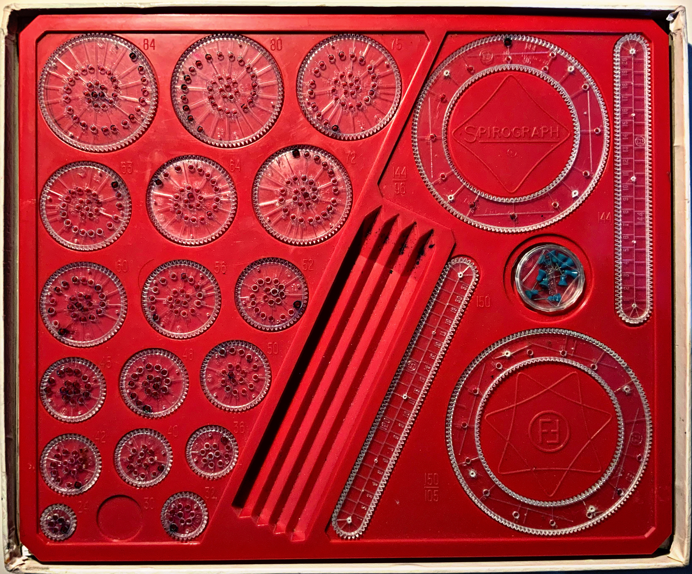
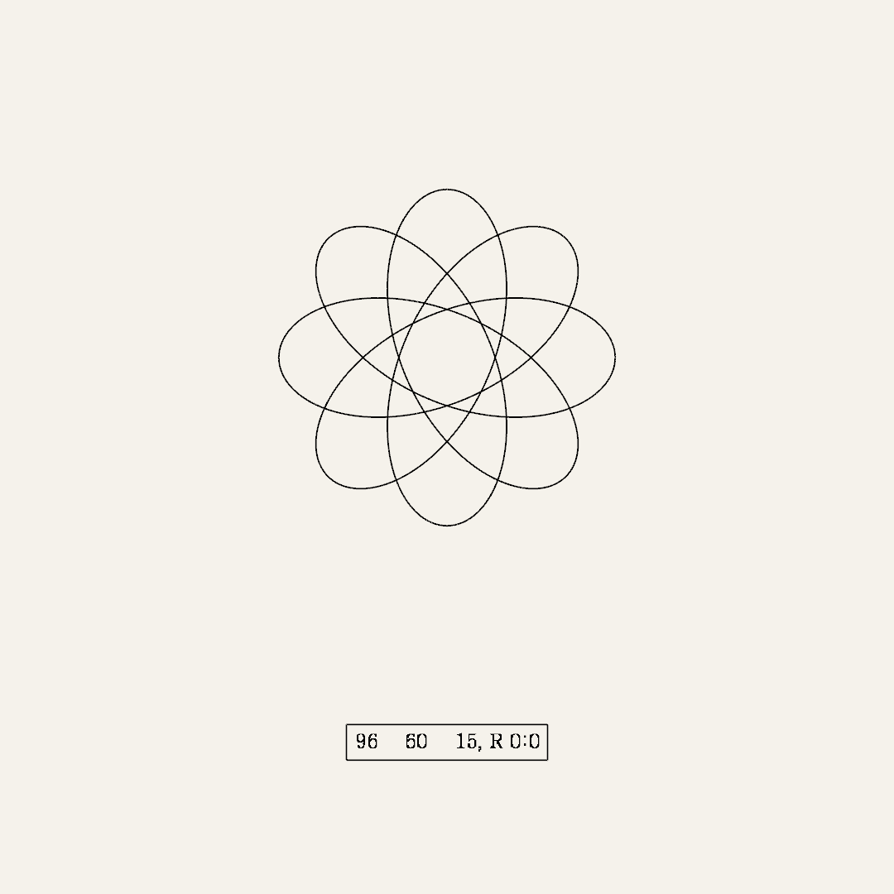
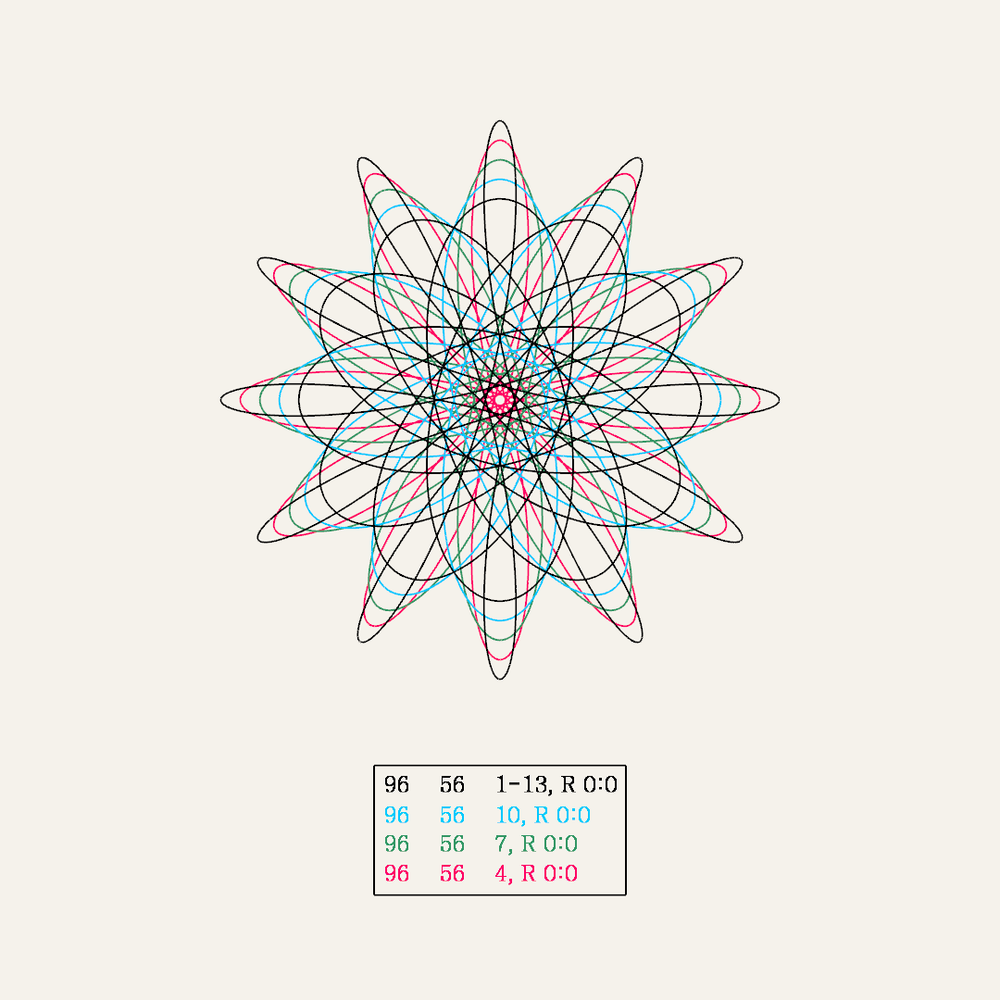

# Spirograph

## Analog Spirograph Study
This is a short study of the mechanics of an analog spirograph in order to understand how it works and programmatically simulate its behaviour and resultant drawings.


### Study of the Mechanics


The mechanics of a spirograph are defined by 3 disks:
+ a static disk (the *ring*),
+ a disk rotating along the ring (the *wheel*), and
+ a disk rotating along the wheel (the *brush*), from wich the resultant curves are drawn.

For the study, both the wheel and the brush rotate internally. This means, the wheel rotates inside the ring, and the brush rotates inside the wheel (as shown in the gif).

There are a lot of possibilities regarding to rings, wheels or brushes and their combination. The picture with the red box shows the disks offered by the analog version, and some parameters to identify or differentiate them. Let's take a look at them in more detail.

On the left side of the red box, there is a collection of disks with holes. Those disks represent both the wheels and the brushes. Each disk is a wheel, and the number next to it defines the amount of cogwheels of the wheel (e.g. 84, 80, 75, etc.). At the same time, each wheel presents several holes forming a spiral. Each one of these holes defines a different brush for that specific wheel. Hence, a single wheel can offer multiple resultant spirographs by using a different brush/hole each time.

On the right side, there are two circles and two bars. The bars are not covered by this study, so let's ignore them for now. The circles represent the rings, and the numbers written as a fraction represent the amount of cogwheels of the external (numerator) and the internal (denominator) part of the ring.

Any wheel can be placed attached to any cogwheel of any ring. With a pen on any hole of the chosen wheel, one can start rolling along the ring in order to draw the spirograph. In short, the resultant spirograph will depend on the following parameters:
- the size of the ring,
- the size of the wheel,
- the hole where the pen is placed (i.e. the brush), and
- the cogwheel of the ring where the wheel starts rotating.

Note that a spirograph can be defined either by one specific combination of ring, wheel, brush and starting position or multiple of them. In other words, one can combine multiple curves on the same spirograph to generate more complex drawings.

### Simulation
The mechanics and pieces of the analog spirograph generator have been translated into code, so that given a set of parameters the corresponding spirograph is drawn.

The following examples show a spirograph composed by a single curve and another one composed by multiple curves:



The parameters used to generate each one of them are contained in the box below the spirograph. Each line defines a set of curves. All the curves in a set are defined by the same ring and wheel, they have the same global origin and relative rotation, plus they are all drawn with the same color. In detail, a line of parameters is represented by:
```
<RING> <WHEEL> <BRUSHES>, R <STATIC_ROTATION>:<DYNAMIC_ROTATION>
```
- `RING`: number of cogwheels of the internal side of the ring. This value is proportional to the perimeter of the ring.
- `WHEEL`: number of cogwheels of the external side of the wheel. This value is proportional to the perimeters of the wheel.
- `BRUSHES`: list of holes from which to draw a spirograph, fixing the given ring and wheel. This value is proportional to the brush radius, i.e. to the radius of the disk representing the brush.
- `STATIC_ROTATION`: angle in degrees (0-360) representing the cogwheel of the ring to take as a global starting point.
- `DYNAMIC_ROTATION`: angle in degrees (0-360) representing the shift of cogwheels in relation to the previous drawn curve. This value only makes sense for sets of more than one curve, since each curve shifts its starting point in relation to the previous one. As an example, if we draw 3 curves and the dynamic rotation is set to 45, each curve will start its path 45 degrees further from the previous one, e.g. if the first curve starts at 0, the second one will start at 45, and the third one at 90.

It is worth mentioning that the order of the list of parameters matters. The spirographs are drawn in the reverse order of the list, so that the last one is drawn first, the second-to-last is drawn second, etc. This is important since a top spirograph might hide some parts of the bottom spirographs. That way, the order of the list of parameters reflects also the priority of the spirographs.